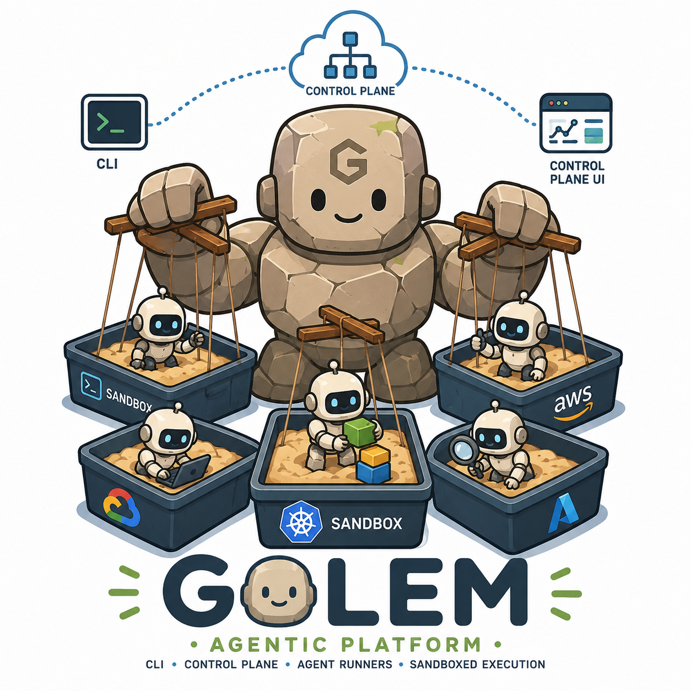

<p align="center">
  
</p>

<h1 align="center">Golem</h1>
<p align="center"><strong>Kubernetes-native Agent-as-a-Service platform</strong></p>
<p align="center">
  Create isolated AI agents on demand · Chat with them in streaming · Let them cooperate · Run autonomous background tasks
</p>

---

## Documentation

| Document | Description |
|---|---|
| [Architecture](docs/Architecture.md) | Components, protocols (MCP / A2A), security model, and end-to-end data flow |
| [Security](docs/Security.md) | K8s RBAC, sandbox isolation, secrets management, and hardening roadmap |
| [Golem Runner](docs/GolemRunner.md) | Agent Runner — generic Docker container, skills catalogue, local test guide |
| [Golem Control Plane](docs/GolemControlPlane.md) | Control Plane — REST API, K8s Provisioner, A2A Card Registry |
| [Roadmap](docs/Roadmap.md) | 4-week MVP sprint plan, delivery matrix, and post-MVP milestones |

---

## Overview

Golem is built on four core components:

1. **Control Plane** (FastAPI) — REST/WebSocket API, agent registry, chat proxy, K8s provisioner
2. **Agent Sandbox** — one isolated K8s Namespace per agent, with NetworkPolicy and ResourceQuota
3. **Agent Runner** — a single generic Docker image (LangGraph + WatsonX) configured at runtime via env vars
4. **CLI** — Python + Typer (`golem agent create`, `golem chat`, `golem agent tasks`)

Agents cooperate using **A2A** (Agent-to-Agent Protocol v1.0) for peer delegation and **MCP** (Model Context Protocol) for tool/resource access. See [docs/Architecture.md](docs/Architecture.md) for the full design.

---

## Prerequisites

| Tool | Version | Purpose |
|---|---|---|
| Python | 3.12+ | Runtime for both components |
| [uv](https://docs.astral.sh/uv/) | latest | Dependency management |
| [Podman](https://podman.io/) | 4+ | Container builds |
| [Minikube](https://minikube.sigs.k8s.io/) | latest | Local K8s cluster |
| [kubectl](https://kubernetes.io/docs/tasks/tools/) | 1.28+ | Cluster management |

---

## Local Development

### 1. Install dependencies

```bash
uv sync --group dev
```

### 2. Run the test suite

```bash
uv run pytest tests/
```

### 3. Run linters and pre-commit

```bash
uv run pre-commit run --all-files
```

---

## Deploy on Minikube

### Step 1 — Start Minikube

```bash
minikube start --driver=podman --container-runtime=containerd
```

### Step 2 — Build and load the Agent Runner image

```bash
cd src/golem-runner
podman build -t localhost/golem-runner:v1 .
podman save localhost/golem-runner:v1 | minikube image load --overwrite=true -
```

### Step 3 — Build and load the Control Plane image

```bash
cd src/golem-control-plane
podman build -t localhost/golem-control-plane:v1 .
podman save localhost/golem-control-plane:v1 | minikube image load --overwrite=true -
```

### Step 4 — Create the WatsonX credentials secret

```bash
cp deploy/golem-control-plane/secret.yaml.example deploy/golem-control-plane/secret.yaml
# Edit secret.yaml and fill in your real WatsonX credentials
```

### Step 5 — Apply all manifests

```bash
kubectl apply -f deploy/golem-control-plane/namespace.yaml
kubectl apply -f deploy/golem-control-plane/serviceaccount.yaml
kubectl apply -f deploy/golem-control-plane/clusterrole.yaml
kubectl apply -f deploy/golem-control-plane/clusterrolebinding.yaml
kubectl apply -f deploy/golem-control-plane/secret.yaml
kubectl apply -f deploy/golem-control-plane/deployment.yaml
kubectl apply -f deploy/golem-control-plane/service.yaml
```

### Step 6 — Verify the Control Plane is running

```bash
kubectl get pods -n golem-system
# NAME                                   READY   STATUS    RESTARTS   AGE
# golem-control-plane-xxxx-xxxx          1/1     Running   0          30s
```

### Step 7 — Expose the Control Plane locally

```bash
# Keep this terminal open — it forwards port 9001 to the Control Plane
kubectl port-forward -n golem-system svc/golem-control-plane 9001:9000
```

### Step 8 — Create your first agent

```bash
curl -s -X POST http://localhost:9001/agents \
  -H "Content-Type: application/json" \
  -d '{
    "name": "diag-agent",
    "system_prompt": "You are a network diagnostics agent. Use your tools to check connectivity.",
    "enabled_skills": ["bash", "http_check"],
    "ttl_seconds": 3600
  }' | python3 -m json.tool
```

The response includes an `agent_id`. Use it to monitor the sandbox:

```bash
# Watch the agent pod come up
kubectl get pods -n golem-agent-<agent_id> -w

# Poll status via Control Plane
curl -s http://localhost:9001/agents/<agent_id>/status | python3 -m json.tool
```

---

## Project Layout

```
golem/
├── src/
│   ├── golem-runner/          # Agent Runner (FastAPI + LangGraph + WatsonX)
│   └── golem-control-plane/   # Control Plane (FastAPI + kubernetes-client)
├── deploy/
│   └── golem-control-plane/   # K8s manifests (Namespace, RBAC, Deployment, Service)
├── tests/
│   └── unit/                  # Unit tests for both components
├── docs/                      # Architecture, Security, Roadmap, component deep-dives
├── pyproject.toml             # Root: ruff, mypy, pytest config
└── .pre-commit-config.yaml    # ruff, mypy, bandit, detect-secrets
```

---

## Dev Tools

```bash
uv run ruff check src tests/
uv run ruff format src tests/
uv run mypy src
uv run bandit -r src --exclude src/golem-runner/.venv,src/golem-control-plane/.venv
pre-commit run --all-files
```
