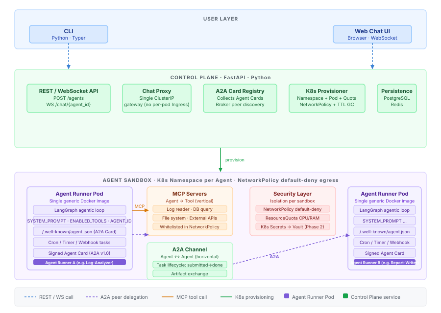

# Golem — Architecture

> **Component deep-dives:** [Golem Runner (Agent Runner)](GolemRunner.md)

Golem is a **Kubernetes-native Agent-as-a-Service platform**.  
It lets you create isolated AI agents on demand, chat with them in streaming, let them cooperate with each other, and run autonomous background tasks — all from a single CLI or web interface.

---

## Overview



The platform is built from **four core components**, plus two cross-cutting layers (security and cooperation protocols) that together make sandboxed, multi-agent execution possible.

---

## Components

### 1. Control Plane  `FastAPI · Python · PostgreSQL · Redis`

The central brain of the platform. It is the only component exposed outside the cluster.

| Service | Responsibility |
|---|---|
| **REST / WebSocket API** | `POST /agents` to create an agent; `WS /chat/{agent_id}` to stream messages |
| **Chat Proxy** | Single internal ClusterIP gateway that forwards WebSocket traffic to the correct agent pod — no per-agent Ingress required |
| **A2A Card Registry** | Collects the Agent Card published by every pod at `/.well-known/agent.json`, verifies its signature, and answers peer-discovery queries ("who can do X?") |
| **K8s Provisioner** | Translates an agent creation request into a Kubernetes Namespace + Pod + ResourceQuota + NetworkPolicy; also runs TTL-based garbage collection of idle sandboxes |
| **Persistence** | Stores message history, agent state, and A2A task lifecycle records in PostgreSQL (durable) and Redis (fast ephemeral state) |

---

### 2. Agent Sandbox  `K8s Namespace per agent`

Each agent lives in its own isolated Kubernetes Namespace. The sandbox contains a single **Agent Runner Pod** plus the security rules that protect both the agent and the rest of the cluster.

#### Agent Runner Pod  `Docker · LangGraph · a2a-sdk · mcp-sdk`

> Full implementation guide: [GolemRunner.md](GolemRunner.md)

A **single generic Docker image** that is parameterised entirely at runtime via environment variables:

| Variable | Purpose |
|---|---|
| `SYSTEM_PROMPT` | The agent's persona and instructions |
| `ENABLED_TOOLS` | Comma-separated list of MCP tool IDs to activate |
| `AGENT_ID` | Unique identifier used in A2A Agent Cards and routing |

The runner:
- Executes a **LangGraph** agentic loop (reasoning + tool calls)
- Publishes an **A2A Agent Card** at `/.well-known/agent.json` (signed, A2A v1.0)
- Accepts inbound A2A task delegation from peer agents
- Supports **background tasks**: Cron, Timer, and Webhook triggers that run independently of any open chat session

---

### 3. Cooperation Layer

Two protocols handle agent interactions, operating on orthogonal axes:

#### MCP — Model Context Protocol  `agent → tool (vertical)`

An agent uses MCP to call **tools and external resources**: read logs, query a database, call an API, access the filesystem. It is a function-call model (request → result). Tool endpoints are declared in the agent's skill configuration and whitelisted in the sandbox's NetworkPolicy.

#### A2A — Agent-to-Agent Protocol  `agent ↔ agent (horizontal)`

An agent uses A2A to **delegate tasks to peer agents** as autonomous actors. It is a task-delegation model with a full lifecycle (`submitted → working → completed / failed`) and structured artifact exchange.

- Initial peer discovery is brokered by the Control Plane's **A2A Card Registry**
- Once discovered, pods communicate directly via K8s ClusterIP Services
- Agent Cards are **signed** (A2A v1.0) to prevent a compromised sandbox from impersonating another agent

**Rule of thumb:** if an agent needs data or needs to trigger an action → MCP. If an agent needs another agent's judgment or specialised capability → A2A.

---

### 4. CLI / Web Chat  `Python · Typer`

The user-facing surface. Implemented entirely in Python (Typer) to share the same stack as the rest of the platform. A distributable Go binary is a future option, but not required for the MVP.

```
golem agent create --name "Log-Analyzer" --prompt "..." --skills read-logs
golem chat --agent log-analyzer-001
golem agent list
golem agent tasks --agent log-analyzer-001
```

---

## Security & Isolation

| Control | Detail |
|---|---|
| **NetworkPolicy** | Default-deny all egress per sandbox. Whitelist added by the Provisioner for: declared MCP server endpoints + authorised A2A peer pods only |
| **ResourceQuota** | CPU and RAM hard limits per Namespace, set at pod creation |
| **Secrets** | K8s Secrets at MVP; migration path to Vault or an external secret store is planned — credentials are never embedded in image layers |
| **Sandbox GC** | A TTL annotation is set on each pod at creation; an idle sandbox is deleted automatically to prevent Namespace sprawl |
| **Runtime isolation** | gVisor / Kata Containers are optional at MVP but recommended when agents execute dynamically generated code |

---

## Data Flow — End-to-End Example

User asks `Log-Analyzer` to analyse logs and produce a PDF report (delegated to `Report-Writer`):

```
User CLI
  → WS /chat/log-analyzer-001          (Control Plane WebSocket API)
    → Log-Analyzer Pod                 (LangGraph loop)
      → MCP: read-logs tool            (get raw log data)
      → A2A: SendMessage → Control Plane Card Registry
        → Report-Writer Pod            (A2A task: submitted → working)
          → MCP: pdf-generator tool
          ← artifact: report.pdf       (A2A task: completed)
      ← A2A artifact received
  ← streaming response + PDF link      (User CLI)
```

`Log-Analyzer`'s NetworkPolicy permits egress only to:
1. The `read-logs` MCP server endpoint
2. `Report-Writer`'s ClusterIP Service

If `Log-Analyzer` is compromised, it cannot reach any other pod or the public internet.

---

## Internal Libraries — Post-MVP Vision

The Agent Runner container today embeds all logic directly (MVP approach). As the platform matures, two internal libraries will be extracted to keep the runner thin and the platform extensible.

### `golem-agent-sdk` — A2A lifecycle + platform identity

Everything related to the agent's identity and communication with the Golem platform:

| Responsibility | Detail |
|---|---|
| **Agent Card** | Generates and serves `/.well-known/agent.json` |
| **A2A client** | Delegates tasks to peer agents |
| **A2A server** | Receives inbound task delegations from peers |
| **Lifecycle** | Heartbeat, registration with Control Plane, graceful shutdown |
| **Config** | Standardised reading of Golem environment variables |

Framework-agnostic — imported by any runner regardless of the LLM backend.

### `golem-framework` — LLM framework abstraction

A thin portability layer that hides the underlying agentic framework behind a common interface, allowing the runner to swap or add LLM backends without rewriting business logic:

```
golem-framework
└── backends/
    ├── langgraph.py   ← MVP
    ├── autogen.py     ← future
    └── crewai.py      ← future
```

For the MVP both libraries live as embedded modules inside the monorepo. They become standalone PyPI packages when the platform stabilises (Phase 2).

---

## Provisioner Abstraction

The K8s Provisioner is accessed through a `Provisioner.create_sandbox()` interface. The only implementation for MVP is Kubernetes, but the abstraction allows adding a lightweight Docker Compose backend later (e.g. for single-machine development) without rewriting the Control Plane.

```python
class Provisioner(ABC):
    @abstractmethod
    def create_sandbox(self, agent: AgentSpec) -> SandboxHandle: ...

    @abstractmethod
    def delete_sandbox(self, handle: SandboxHandle) -> None: ...
```
