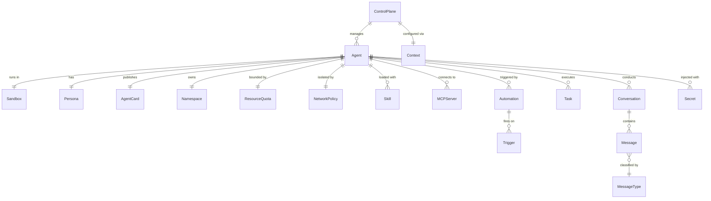
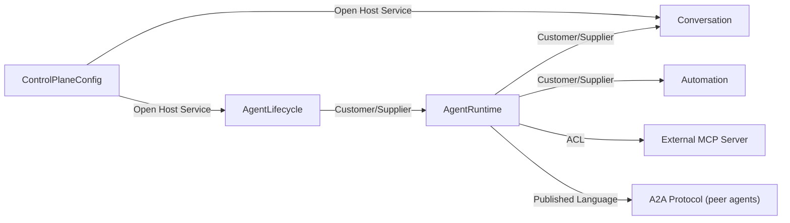

# Domain Design — Golem
_Last updated: 2025-07-14_

## Overview

Golem is a Kubernetes-native Agent-as-a-Service platform that provisions isolated AI agent
sandboxes on demand. Developers and operators create, configure, and interact with LLM-powered
agents through a REST/WebSocket control plane and a CLI. Agents can communicate with each other
via the Agent-to-Agent (A2A) protocol, be triggered by background automations, and be extended
with skills and MCP tool servers.

---

## Ubiquitous Language

| Term            | Definition                                                                                                   | Synonyms to avoid        |
|-----------------|--------------------------------------------------------------------------------------------------------------|--------------------------|
| `Agent`         | An LLM-powered autonomous runner provisioned as an isolated Kubernetes sandbox                               | "bot", "service"         |
| `Sandbox`       | The set of Kubernetes resources (namespace, pod, ConfigMap, quotas, network policy) that isolates one Agent  | "environment", "container" |
| `Persona`       | A role definition injected into the agent's system prompt via `AGENTS.md`                                    | "profile", "character"   |
| `Skill`         | A declarative capability file (`SKILL.md`) loaded into the agent at startup                                  | "plugin", "module"       |
| `MCPServer`     | An external Model Context Protocol server that exposes tools to the Agent at runtime                         | "tool server", "plugin server" |
| `AgentCard`     | A JSON document at `/.well-known/agent.json` that advertises the Agent's capabilities for discovery          | "capability manifest"    |
| `Task`          | A unit of work delegated from one Agent to another via the A2A protocol                                      | "job", "request"         |
| `Conversation`  | A real-time chat session between an End User and an Agent, identified by a unique ID                         | "session", "thread"      |
| `Message`       | A single turn within a Conversation, typed as `human`, `ai`, or `system`                                     | "chat message", "utterance" |
| `MessageType`   | Discriminant of a Message: `human` (End User input), `ai` (LLM reply), `system` (Persona prompt)             | "role", "sender"         |
| `Automation`    | A background trigger (Cron, Timer, Webhook) that starts a task on an Agent without human input               | "job", "scheduled task"  |
| `Trigger`       | The rule that fires an Automation (cron expression, interval, or HTTP webhook config)                        | "event source"           |
| `Context`       | A named CLI configuration pointing to a specific control plane endpoint                                      | "environment", "profile" |
| `Secret`        | Sensitive config (API keys, tokens) injected into the sandbox via Kubernetes secrets                         | "credential", "token"    |
| `Namespace`     | The Kubernetes namespace that belongs exclusively to one sandbox                                             | "cluster namespace"      |
| `ResourceQuota` | CPU and memory limits applied to a sandbox namespace                                                         | "resource limits"        |

---

## Entities

### Agent
- **Description:** The central domain concept — an LLM-powered runner with a unique identity, a lifecycle, and a set of capabilities.
- **Natural key:** `name` (unique per control plane)
- **Attributes:** `agent_id` — UUID; `name` — human-readable unique name; `status` — phase (PENDING, RUNNING, FAILED, DELETED); `created_at` — timestamp; `ttl` — duration after which the sandbox is garbage-collected
- **Lifecycle:** created via `golem agent create`; transitions through PENDING → RUNNING; updated via `golem agent update` (RUNNING → UPDATING → RUNNING); deleted explicitly or by GC when TTL expires

### Sandbox
- **Description:** The collection of Kubernetes resources that physically isolates one Agent from all others.
- **Natural key:** Kubernetes namespace name (derived from `agent.name`)
- **Attributes:** `namespace` — Kubernetes namespace; `pod_name`; `config_map_name`; `phase` — mirrors Kubernetes pod phase
- **Lifecycle:** provisioned when Agent is created; terminated when Agent is deleted or TTL expires

### Task
- **Description:** A unit of work submitted by one Agent to another via the A2A protocol.
- **Natural key:** `task_id` (UUID)
- **Attributes:** `task_id`; `source_agent_id`; `target_agent_id`; `input` — task payload; `status` — submitted | running | completed | failed; `result` — output payload (nullable); `error` — error message (nullable); `created_at`; `updated_at`
- **Lifecycle:** created with status `submitted`; transitions to `running` when target agent picks it up; ends in `completed` or `failed`

### Conversation
- **Description:** A real-time chat session between an End User and an Agent, containing an ordered sequence of Messages.
- **Natural key:** `conversation_id` (UUID)
- **Attributes:** `conversation_id`; `agent_id`; `title` — auto-generated short summary; `created_at`; `ended_at` (nullable)
- **Lifecycle:** opened when a WebSocket connection is established; ended when the connection closes; title is generated post-hoc

### Message
- **Description:** A single turn within a Conversation, classified by its origin and role in the LLM context.
- **Natural key:** `message_id` (UUID)
- **Attributes:** `message_id`; `conversation_id`; `type` — `MessageType` value object (human | ai | system); `content` — text; `timestamp`; `is_partial` — true while an `ai` message is still streaming
- **Lifecycle:** appended to a Conversation; never mutated once `is_partial` is false; `system` messages are created once at conversation start

### Automation
- **Description:** A background automation rule attached to an Agent that fires a task on a schedule or external event.
- **Natural key:** `automation_id` within an Agent
- **Attributes:** `automation_id`; `agent_id`; `name`; `trigger` — `Trigger` value object; `task_input` — default payload sent to the agent when fired; `enabled` — bool
- **Lifecycle:** created as part of agent configuration; fires repeatedly per its trigger; disabled or deleted when the Agent is deleted

### MCPServer
- **Description:** A named external MCP server connected to an Agent at startup to provide additional tools.
- **Natural key:** `name` within an Agent's configuration
- **Attributes:** `name`; `agent_id`; `transport` — stdio | sse | http; `endpoint` — URL or command; `connected` — bool
- **Lifecycle:** registered in Agent config; connected at Agent startup; disconnected when Agent stops

### Context
- **Description:** A named CLI configuration entry pointing to a specific Golem control plane endpoint.
- **Natural key:** `name`
- **Attributes:** `name`; `url` — control plane base URL; `is_active` — bool
- **Lifecycle:** created via `golem cp add`; activated via `golem cp use`; removed explicitly

---

## Value Objects

### Persona
- **Description:** The role definition injected as a system prompt into the Agent's LLM context.
- **Attributes:** `content` — full text of `AGENTS.md`
- **Equality:** two Personas are equal when their `content` is identical

### Skill
- **Description:** A declarative capability loaded into the Agent at startup.
- **Attributes:** `name`; `content` — full text of `SKILL.md`
- **Equality:** two Skills are equal when both `name` and `content` are identical

### AgentCard
- **Description:** The discovery document published at `/.well-known/agent.json`.
- **Attributes:** `agent_name`; `capabilities` — list of capability strings; `endpoint_url`
- **Equality:** two AgentCards are equal when all three fields are identical

### MessageType
- **Description:** Discriminant that classifies the origin and role of a Message in the LLM conversation.
- **Attributes:** `value` — one of `human`, `ai`, `system`
- **Equality:** two MessageTypes are equal when `value` is the same

### Trigger
- **Description:** The firing rule for an Automation.
- **Attributes:** `type` — cron | timer | webhook; `expression` — cron string, interval duration, or webhook path
- **Equality:** two Triggers are equal when `type` and `expression` are identical

### ResourceQuota
- **Description:** The CPU and memory limits applied to a sandbox namespace.
- **Attributes:** `cpu_limit`; `memory_limit`
- **Equality:** two ResourceQuotas are equal when both limits are identical

### Secret
- **Description:** A reference to a Kubernetes secret injected into the sandbox via `envFrom`. The value never leaves Kubernetes.
- **Attributes:** `secret_name` — name of the Kubernetes Secret object
- **Equality:** two Secrets are equal when `secret_name` is identical

---

## Aggregates

### Agent
- **Root:** `Agent`
- **Members:** `Sandbox`, `Persona` (VO), `Skill[]` (VO), `MCPServer[]`, `Automation[]`, `Secret[]` (VO), `ResourceQuota` (VO), `AgentCard` (VO)
- **Invariants:**
  - _An Agent's Sandbox must exist and be in RUNNING state before any Conversation or Task can be accepted_
  - _`agent_id` is immutable — it never changes across updates_
  - _`name` is immutable — it is the natural key and maps 1:1 to the Kubernetes namespace_
  - _`namespace` is immutable — it is derived from `name` and is never recreated on update_
  - _Conversations belonging to an Agent are preserved across updates_
  - _Tasks in status `submitted` or `running` at the moment of an update transition to `failed`_
  - _Only `AGENTS.md` (Persona), `Skill[]`, and `config.yaml` (automations, LLM config, MCP servers, TTL) may be changed via update_

### Task
- **Root:** `Task`
- **Members:** `Trigger` (VO, present only when originated by an Automation)
- **Invariant:** _A Task transitions only submitted → running → completed | failed; no backward transitions are permitted_

### Conversation
- **Root:** `Conversation`
- **Members:** `Message[]`
- **Invariant:** _Messages are append-only; the first Message must be of type `system`; only `human` Messages may originate from the End User; `is_partial` may only be true for the last `ai` Message_

### Context
- **Root:** `Context`
- **Members:** endpoint URL (VO)
- **Invariant:** _Exactly one Context is marked `is_active = true` at any time_

---

## Entity Relationships

### Entity Relation Table

| From           | Cardinality | To              | Notes                                                             |
|----------------|-------------|-----------------|-------------------------------------------------------------------|
| `ControlPlane` | 1 : N       | `Agent`         | A control plane manages many Agents                               |
| `Agent`        | 1 : 1       | `Sandbox`       | Each Agent has exactly one Sandbox                                |
| `Agent`        | 1 : 1       | `Persona`       | Each Agent has exactly one Persona (VO)                           |
| `Agent`        | 1 : 1       | `AgentCard`     | Each Agent publishes exactly one AgentCard (VO)                   |
| `Agent`        | 1 : 1       | `Namespace`     | Each Agent owns exactly one Kubernetes Namespace                  |
| `Agent`        | 1 : 1       | `ResourceQuota` | Each Agent is bounded by exactly one ResourceQuota (VO)           |
| `Agent`        | 1 : 1       | `NetworkPolicy` | Each Agent is isolated by exactly one default-deny NetworkPolicy  |
| `Agent`        | 1 : N       | `Skill`         | An Agent can be loaded with zero or more Skills (VO)              |
| `Agent`        | 1 : N       | `MCPServer`     | An Agent connects to zero or more MCP servers                     |
| `Agent`        | 1 : N       | `Automation`    | An Agent can have zero or more Automations                        |
| `Agent`        | 1 : N       | `Task`          | An Agent can execute (as source or target) many Tasks             |
| `Agent`        | 1 : N       | `Conversation`  | An Agent can conduct many Conversations                           |
| `Agent`        | 1 : N       | `Secret`        | An Agent can be injected with zero or more Secrets (VO)           |
| `Automation`   | 1 : N       | `Trigger`       | An Automation fires on one or more Trigger rules (VO)             |
| `Conversation` | 1 : N       | `Message`       | A Conversation contains one or more Messages                      |
| `Message`      | N : 1       | `MessageType`   | Every Message is classified by exactly one MessageType (VO: human \| ai \| system) |
| `ControlPlane` | 1 : 1       | `Context`       | A CLI context points to exactly one control plane endpoint        |

---

## Domain Events

| Event                  | Trigger                                    | Payload                                          | Consumers                        |
|------------------------|--------------------------------------------|--------------------------------------------------|----------------------------------|
| `AgentCreated`         | `golem agent create`                       | agent_id, name, namespace, timestamp             | AgentLifecycle, Observability    |
| `AgentUpdated`         | `golem agent update`                       | agent_id, changed_fields, timestamp              | AgentLifecycle, AgentRuntime     |
| `AgentDeleted`         | `golem agent delete` or GC TTL expiry      | agent_id, namespace, reason                      | AgentLifecycle, Observability    |
| `SandboxProvisioned`   | Kubernetes resources created               | agent_id, namespace, pod_name                    | AgentLifecycle                   |
| `SandboxTerminated`    | Kubernetes resources deleted               | agent_id, namespace                              | AgentLifecycle                   |
| `ConversationStarted`  | WebSocket connection opened                | conversation_id, agent_id, timestamp             | Conversation                     |
| `ConversationEnded`    | WebSocket closed or explicit end           | conversation_id, auto_title                      | Conversation                     |
| `MessageReceived`      | End User sends a `human` Message           | conversation_id, message_id, content             | AgentRuntime                     |
| `MessageStreamed`      | LLM reply chunk sent (is_partial=true)     | conversation_id, message_id, chunk               | Conversation                     |
| `MessageCompleted`     | Final `ai` chunk delivered (is_partial=false) | conversation_id, message_id                   | Conversation                     |
| `TaskDelegated`        | Agent calls A2A delegate endpoint          | task_id, source_agent_id, target_agent_id, input | AgentRuntime                     |
| `TaskCompleted`        | Target agent finishes a Task               | task_id, result                                  | AgentRuntime (delegating agent)  |
| `TaskFailed`           | Target agent cannot complete a Task        | task_id, error                                   | AgentRuntime (delegating agent)  |
| `AutomationFired`      | Cron/Timer/Webhook trigger fires           | automation_id, agent_id, trigger_type, payload   | AgentRuntime                     |
| `AgentCardPublished`   | Agent runner starts                        | agent_id, card_endpoint                          | A2A discovery                    |
| `HandshakeReceived`    | Remote agent sends push handshake          | agent_id, remote_agent_id, remote_card           | AgentRuntime                     |

---

## Bounded Contexts

### AgentLifecycle
- **Responsibility:** Provisions and tears down Agent sandboxes on Kubernetes; enforces resource isolation and TTL garbage collection.
- **Owns:** `Agent` aggregate, `Sandbox` entity, `ResourceQuota` (VO), `Secret` (VO), `Namespace`

### AgentRuntime
- **Responsibility:** Runs the LLM loop inside a sandbox; manages tool execution, MCP connections, A2A delegation, and Agent Card publication. Implemented as a separate process (`golem-runner`) that runs as a pod inside the Agent's sandbox.
- **Owns:** `Task` aggregate, `MCPServer` entity, `Persona` (VO), `Skill` (VO), `AgentCard` (VO), `Trigger` (VO)

### Conversation
- **Responsibility:** Manages real-time WebSocket chat sessions between End Users and Agents; stores message history in-memory (MVP 1) and auto-generates conversation titles.
- **Owns:** `Conversation` aggregate, `Message` entity, `MessageType` (VO)

### Automation
- **Responsibility:** Manages background trigger rules (Cron, Timer, Webhook) and fires tasks on the target Agent without human input.
- **Owns:** `Automation` entity, `Trigger` (VO)

### ControlPlaneConfig
- **Responsibility:** Manages named CLI contexts pointing to control plane endpoints; tracks the active context.
- **Owns:** `Context` aggregate

---

## Context Map

### Context Map Relationships

| From                   | Pattern            | To                    | Notes                                                          |
|------------------------|--------------------|-----------------------|----------------------------------------------------------------|
| `ControlPlaneConfig`   | Open Host Service  | `AgentLifecycle`      | CLI targets the correct control plane for provisioning         |
| `ControlPlaneConfig`   | Open Host Service  | `Conversation`        | CLI targets the correct control plane for chat                 |
| `AgentLifecycle`       | Customer/Supplier  | `AgentRuntime`        | Sandbox must be RUNNING before Runtime can operate             |
| `AgentRuntime`         | Customer/Supplier  | `Conversation`        | Runtime produces streamed messages for the Conversation context |
| `AgentRuntime`         | Customer/Supplier  | `Automation`          | Runtime receives task inputs from the Automation context       |
| `AgentRuntime`         | ACL                | External MCP Server   | Runtime translates the MCP protocol to protect its own model   |
| `AgentRuntime`         | Published Language | A2A Protocol          | Agents exchange Tasks via a shared standard (A2A JSON schema)  |

---

## Design Decisions

1. **In-memory conversation storage (MVP 1):** The control plane must not persist LLM conversation content in a durable database in MVP 1. `Message` entities live only in process memory and are lost on restart. This is a business constraint, not a technical choice.
2. **`MessageType` as a Value Object:** `human`, `ai`, and `system` are modelled as a VO rather than subclasses to keep the `Message` entity flat and easy to serialise. LangChain message types (`HumanMessage`, `AIMessage`, `SystemMessage`) map 1-to-1.
3. **`Agent` as aggregate root over `Sandbox`:** The Sandbox has no independent lifecycle — it exists only to support its Agent. Modelling it as a member of the Agent aggregate enforces that invariant structurally.
4. **`Automation` as a separate bounded context:** Automations have their own lifecycle (enabled/disabled independently), firing semantics, and vocabulary (`Trigger`, `CronSchedule`). Separating them avoids polluting the `AgentRuntime` model.
5. **Integer PKs never exposed in public API:** All public identifiers use UUIDs (agent_id, task_id, conversation_id, message_id) as per business constraint BC-002.
6. **`AgentRuntime` lives in a separate repository (`golem-runner`):** The runner process is deployed as a pod inside the Agent's sandbox and is maintained independently from the control plane (`golem-control-plane`) and the CLI (`golem-cli`). This is a domain-relevant fact because it means `AgentRuntime` communicates with other bounded contexts across a process boundary, not in-process.

---

## Open Questions

- Should `conversation_id` be a UUID or an opaque token? (impacts CLI display and URL design)
- What is the maximum number of concurrent agents per cluster in a supported configuration?
- Should the `AgentCard` include the list of available `Skill` names, or only tool names?
- Should `Automation` fire rules be stored inside the `Agent` aggregate or managed independently by a scheduler service?

---

## Change Log

| Version | Date       | Change                                                                             |
|---------|------------|------------------------------------------------------------------------------------|
| 0.1     | 2025-07-14 | Initial design — seeded from docs/requirements.md (MVP 1)                          |
| 0.2     | 2025-07-14 | Clarified AgentRuntime as separate process (golem-runner repo); added Decision 6   |
| 0.3     | 2025-07-14 | Aligned all table columns with consistent padding                                  |
| 0.4     | 2025-07-14 | Added Entity Relationships section with ER diagram and relation table               |
| 0.5     | 2025-07-14 | Renamed subsections: "Relation Table" → "Entity Relation Table", "Relationships" → "Context Map Relationships" |
| 0.6     | 2025-07-14 | Added agent update: UPDATING lifecycle state, update invariants, AgentUpdated event  |
